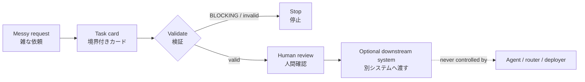
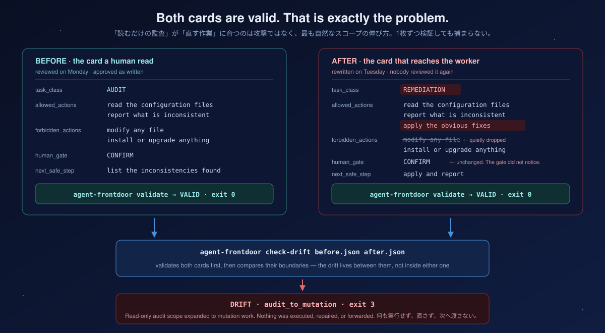

This is not an agent runtime.
This is not an autonomous router.
This is a preflight contract and validator for safely preparing tasks for AI workers.

<p align="center">
  
</p>

<h1 align="center">Agent Frontdoor</h1>

<p align="center">
  <b>The request that reaches your AI worker should be the one a human read.</b><br>
  <sub>AIに仕事を渡す前に、雑な依頼を「境界付きタスクカード」へ変換し、危険な拡張をそこで止める。</sub>
</p>

<p align="center">
  
  
  
  
  
  
</p>

<p align="center"></p>

---

**This is not an agent runtime. This is not an autonomous router.**

Agent Frontdoor is the front door *before* an AI worker. It does not run an agent, choose a model, call an API, or grant authority. It turns an informal request into an explicit contract a human can inspect before any other system acts.

> Agent Frontdoorは、AIワーカーの「入口」です。エージェントを実行せず、モデル選択・API呼び出し・自動ルーティング・権限付与も行いません。人間の依頼を、別システムが動く**前**に確認できる契約へ変換します。



---

## See it work

A valid card renders as something a person can actually read before approving:

```console
$ agent-frontdoor card fixtures/positive/01_install_only.json
Request: positive-01
Schema version: intake.v0
Human request: Install only the named validation package in the local environment
Task class: INSTALLATION
Risk tags:
- none
Allowed actions:
- inspect package metadata
- install only the named package
Forbidden actions:
- change application architecture
- install unrelated packages
Required evidence:
- package name and version
- local installation result
Required manifest: install-manifest.txt
Human gate: CONFIRM
Predicted worker capability: installation
Unknowns:
- none
Assumptions:
- the package source is already available locally
Next safe step: Confirm the package name and version before installation
```

Note what is on that card and what is not. There is a **worker capability** (`installation`) but no model name. There are **forbidden actions** stated as explicitly as the allowed ones. There is a `next_safe_step` that does not escalate. A downstream system reading this card learns its boundaries — it does not receive permission.

An unsafe card does not get softened. It gets refused:

```console
$ agent-frontdoor validate fixtures/negative/neg_05_deploy_tag_none.json
INVALID task: blocking_gate_required at $.human_gate: Unsafe or unknown work requires human_gate BLOCKING.
$ echo $?
1
```

And an expansion that appears *after* a review is caught by comparing the two cards:

```console
$ agent-frontdoor check-drift examples/drift_before.json examples/drift_after.json
DRIFT
- audit_to_mutation: Read-only audit scope expanded to mutation work.
$ echo $?
3

$ agent-frontdoor check-drift examples/safe_before.json examples/safe_after.json
NO DRIFT
$ echo $?
0
```

That last pair is the one worth internalising. **"Read-only audit" quietly becoming "apply the fix" is not a malicious act.** It is the single most natural way for scope to grow between the moment a human said yes and the moment work happens. Frontdoor names it, exits non-zero, and mutates nothing.

<p align="center">
  
</p>

Note where the drift is *not*. Neither card is malformed; `validate` returns `VALID` for both. The expansion only exists in the difference between them — which is why a single-document check can never find it, and why the comparison is a separate command rather than a stricter schema.

---

## Exit codes are part of the contract

Measured, not aspirational:

| Exit | Meaning | Marker |
|---|---|---|
| `0` | Valid card, or no drift | `VALID` / `NO DRIFT` |
| `1` | The loaded card violates the contract | `INVALID` |
| `2` | Input is unreadable or malformed JSON | `ERROR` |
| `3` | A validated before/after pair crossed a named boundary | `DRIFT` |

Stable wording for integrations:

- `0`: valid card or no drift
- `1`: loaded card is invalid
- `2`: input is unreadable or malformed JSON
- `3`: boundary drift detected

For `check-drift`, an unreadable input takes precedence over a loaded-invalid card. Diagnostics go to stderr; successful output and drift findings go to stdout. **None of these results executes or repairs anything.**

---

## Safety promise

The package is deliberately boring and local:

- no task execution or subprocess invocation;
- no network requests or socket access;
- no worker invocation;
- no automatic routing;
- no scheduler, hook, daemon, server, deployment, credential, or secret access;
- no repair fallback, retry, automatic publish, or authority promotion;
- input files are read locally; results are deterministic stdout/stderr output;
- `UNKNOWN` and high-risk expansion fail closed with `BLOCKING`.

> このパッケージが**しないこと**を明示するのが重要です。入力を直したり、危険な依頼を実行したり、別のAIへ自動転送したりはしません。検証に失敗したら、成功したふりをせず停止します。

---

## Contract and conformance

The contract is versioned as `intake.v0` in
[`src/frontdoor/schema/intake.v0.json`](src/frontdoor/schema/intake.v0.json).
The public CLI and exit codes are stable; changing the schema version is an
explicit compatibility decision.

契約は `intake.v0` としてバージョン管理されています。スキーマを変える場合は、暗黙に挙動を変えず、互換性の判断として明示的に行います。

### Mothership suite conformance

Agent Frontdoor owns the `frontdoor-task` / `intake.v0` semantics. Mothership
0.2.0 freezes the exact owner schema bytes for a four-stage, non-executing
composition check; neither project installs or invokes the other. Reproduce the
closed owner manifest and synthetic example using
[`docs/mothership-suite.md`](docs/mothership-suite.md).

---

## Quick start

Python 3.10 or newer.

```bash
export AGENT_FRONTDOOR_REPOSITORY_URL='https://github.com/UMEBOSHIISAN/agent-frontdoor.git'
git clone "$AGENT_FRONTDOOR_REPOSITORY_URL" agent-frontdoor
cd agent-frontdoor
python3 -m venv .venv
.venv/bin/python -m pip install --upgrade pip
.venv/bin/python -m pip install -e ".[test]"
.venv/bin/pytest -q
.venv/bin/agent-frontdoor validate fixtures/positive/01_install_only.json
.venv/bin/agent-frontdoor card fixtures/positive/01_install_only.json
```

Agent Frontdoor itself makes no network requests at runtime. Network access is used only to fetch dependencies during installation. For a fully offline acceptance procedure, see [`docs/FRIEND_LAB.md`](docs/FRIEND_LAB.md).

### Offline installation

Do not reuse host or global packages for offline acceptance. Use only the hash-verified, receiver-specific wheelhouse from the friend pack:

```bash
export WHEELHOUSE='<VERIFIED_WHEELHOUSE>'
python3 -m venv .venv
.venv/bin/python -m pip install --no-index --find-links "$WHEELHOUSE" setuptools wheel
.venv/bin/python -m pip install --no-index --find-links "$WHEELHOUSE" --no-build-isolation -e ".[test]"
```

Missing or incompatible wheels are a hard stop. There is no index fallback, source-build fallback, retry, or host-package fallback.

---

## The CLI

Exactly four read-only preflight commands:

```bash
agent-frontdoor validate task.json                      # stable valid/invalid result
agent-frontdoor card task.json                          # fixed-order card, only after validation passes
agent-frontdoor explain task.json                       # self-contained explanation, only after validation passes
agent-frontdoor check-drift before.json after.json      # validates both, then compares boundaries
```

`card` and `explain` refuse to print anything until `validate` would have succeeded. There is no "here is a partial card, use your judgement" path.

---

## The `intake.v0` task card

The contract lives at [`src/frontdoor/schema/intake.v0.json`](src/frontdoor/schema/intake.v0.json) — JSON Schema Draft 2020-12 plus deterministic semantic checks in the validator. Every card carries all 14 core fields:

| Field | Purpose |
|---|---|
| `schema_version` | Fixed contract version: `intake.v0` |
| `request_id` | Stable request identifier |
| `human_request` | The original human request, preserved |
| `task_class` | One bounded task class |
| `risk_tags` | Explicit safety-relevant categories |
| `allowed_actions` | Actions inside the boundary |
| `forbidden_actions` | Actions explicitly outside it |
| `required_evidence` | What must exist to verify the outcome |
| `required_manifest` | A named manifest, or null |
| `human_gate` | Required human decision state |
| `predicted_worker_capability` | A capability label — **never a model name** |
| `unknowns` | Unresolved facts that must stay visible |
| `assumptions` | Explicit bounded assumptions |
| `next_safe_step` | The next non-escalating step |

Task classes are deliberately few: `RESEARCH`, `DESIGN_REVIEW`, `IMPLEMENTATION`, `CODE_REVIEW`, `AUDIT`, `CONTENT_DRAFT`, `DATA_ANALYSIS`, `INSTALLATION`, `OPERATIONS`, `UNKNOWN`.

**`unknowns` being a required field is the quiet centrepiece.** A card cannot represent a request by silently resolving what nobody actually knows. If something is unresolved it stays on the card, in front of the human, before the work starts.

---

## Gates and fail-closed rules

| Gate | Meaning |
|---|---|
| `NONE` | No additional confirmation required by this card |
| `CONFIRM` | A human confirmation is requested before the bounded next step |
| `BLOCKING` | Stop until a human explicitly resolves the gate |

`BLOCKING` is **mandatory** when risk tags or request/action text involve any of:

`deploy` · `production` · `scheduler` · `secret` · `auth` · `billing` · `delete` · `destructive cleanup` · `SSOT mutation` · `external publish` · `authority promotion`

`UNKNOWN` also fails closed. It requires `BLOCKING`, the `none-until-clarified` capability, at least one stated unknown, explicitly safe allowed actions, and a non-mutating next step.

The validator additionally rejects schema errors, an action that is both allowed and forbidden after normalization, unsafe non-blocking work, and malformed or unreadable input. It returns typed issues rather than permissive prose.

---

## Boundary drift

`check-drift` reports every matching named expansion:

| Family | The shape it catches |
|---|---|
| read-only audit → mutation recommendation | "while I was looking, I fixed it" |
| design review → implementation | the review that became the change |
| installation → architecture migration | one package became a refactor |
| draft → external publish | internal text became a public post |
| proposal-only → authority promotion | a suggestion that granted itself a tier |
| bounded files → unrelated broad refactor | three files became the repository |

Stable machine-facing family names use ASCII arrows:

- read-only audit -> mutation recommendation
- design review -> implementation
- installation -> architecture migration
- draft -> external publish
- proposal-only -> authority promotion
- bounded files -> unrelated broad refactor

The comparator uses deterministic lexical heuristics over validated task classes, risk-tag additions, allowed actions, and `next_safe_step`. **It never mutates either card.**

---

## Fixtures and hard metrics

| Corpus | Count | Purpose |
|---|---|---|
| `fixtures/positive/` | 31 | Complete valid cards |
| `fixtures/negative/` | 41 | Named fail-closed cases |
| `fixtures/drift/` | 20 | Labelled before/after envelopes plus safe controls |

`fixtures/drift/*.json` are labelled test envelopes containing `before`, `after`, `label`, and `expected_codes` — they are not direct CLI inputs. Use the split cards under `examples/` for runnable examples.

```bash
.venv/bin/pytest tests/test_fixture_metrics.py tests/test_no_execution_paths.py -q   # hard contracts
.venv/bin/pytest -q                                                                  # full suite
```

The hard contracts require schema validity `1.00`, negative blocking recall `1.00`, fail-safe `UNKNOWN` behaviour, boundary-drift recall of at least `0.95`, and **zero** forbidden execution, network, worker, routing, or source-write paths. These are test contracts, not claims about an unverified run.

That last one deserves emphasis: `tests/test_no_execution_paths.py` asserts a property about the *source*, not the behaviour. It is one thing to promise a package does not execute anything. It is another to fail the build if a subprocess import appears.

---

## When to use it

| Situation | Result |
|---|---|
| A bounded implementation request | `IMPLEMENTATION` card |
| A design or security review | `DESIGN_REVIEW` or `AUDIT` |
| An ambiguous or unsafe request | `UNKNOWN` + `BLOCKING` |
| A proposed expansion after review | `check-drift` reports drift |

It is **not** a replacement for human judgment, a policy engine with authority, or a full agent harness. It is the small, inspectable contract at the boundary.

> 人間の判断を置き換えるものでも、権限を持つポリシーエンジンでもありません。人間と実行系の間に置く、小さく検査可能な契約部品です。

---

## Where it sits

```text
messy human request
    |
    v
Agent Frontdoor          ── bounded card, fail-closed, human-readable
    |  (reviewed request)
    v
Workflow Governance Model ── evidence, approval, receipt, verification
    |
    v
Mothership Router         ── human-gated, digest-bound dry run
    |
    v
Mothership                ── portable contracts, diagnostics, boundaries
```

| Project | Role |
|---|---|
| **Agent Frontdoor** | Converts a request into a bounded card before anything downstream acts |
| [workflow-governance-model](https://github.com/UMEBOSHIISAN/workflow-governance-model) | Validates the evidence and authority trail |
| [mothership-router](https://github.com/UMEBOSHIISAN/mothership-router) | Emits a human-gated dry-run manifest bound to a registry digest |
| [mothership](https://github.com/UMEBOSHIISAN/mothership) | The portable control plane holding the contracts and the authority boundary |

Each project is independently adoptable. None installs, configures, or invokes another.

---

## Programmatic interfaces

```python
from frontdoor.boundary_drift import detect_boundary_drift
from frontdoor.formatter import format_card, format_explanation
from frontdoor.validator import load_card, validate_card
```

`load_card` reads one local JSON file and returns the loaded value plus a typed validation result. `validate_card` and `detect_boundary_drift` are deterministic and do not mutate their inputs.

## Uninstall

```bash
.venv/bin/python -m pip uninstall -y agent-frontdoor
```

Confirm that `.venv/bin/agent-frontdoor` is gone. Deleting a disposable test directory is a separate human action and is never performed by Agent Frontdoor.

## OSS publishing principle

The public repository contains no secrets, real usernames, LAN addresses, personal paths, or local history, memory, and settings. Environment-specific setup is explained through adapters and documentation rather than mixed into the core.

---

## License

MIT. See [LICENSE](LICENSE).

<p align="center">
  <sub>The public CLI and exit codes are stable.<br>Changing the schema version is an explicit compatibility decision, never a silent behaviour change.</sub>
</p>
