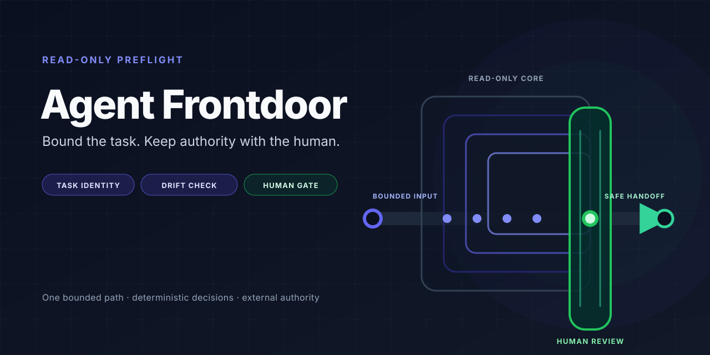

<p align="center">
  
</p>

# Agent Frontdoor

<p align="center"><strong>Stop AI coding agents from drifting beyond the task you approved.</strong></p>

Agent Frontdoorは、読み取り専用コアで承認済みの依頼を境界付きカードに固定し、AIコーディングエージェントの逸脱を実行前に止める安全ゲートウェイです。

<p align="center">
  
</p>

This is not an agent runtime.
This is not an autonomous router.

Agent Frontdoor is a local AI agent safety gateway. It turns an informal request
into an inspectable task card, detects later boundary expansion, and checks
whether a proposed tool action still belongs to the literal intent. Another
human or host remains responsible for permission, execution, and results.

## See the boundary

Suppose a local MCP client reports `invalid_grant` for the literal target
`cloudflare-api`. Intent Lock evaluates proposed action text as data:

| Evaluated text | Decision |
| --- | --- |
| Exact-target action: `codex mcp login cloudflare-api` | Intent-consistent only; independent permission and human gates still apply. |
| Adjacent action: `npx wrangler whoami` | Denied with `literal_target_mismatch`. |

Neither string is run by this comparison. Agent Frontdoor does not execute
commands, and an intent match does not grant authority.

The same fail-closed rule gives task cards and later revisions concrete results:

| Boundary check | Example result | Meaning |
| --- | --- | --- |
| A bounded local audit card | `VALID example-readme-audit` | The card satisfies the input contract; it is not approval to perform the audit. |
| A successfully loaded but contract-invalid or unsafe card | `INVALID` (exit `1`) | The card is refused instead of softened into a runnable task. |
| Unreadable input or malformed JSON | `ERROR` (exit `2`) | Input handling stops before a task card is accepted. |
| A read-only audit becomes “apply the fix” | `DRIFT` with `audit_to_mutation` | The expansion is reported, exits non-zero, and mutates nothing. |

## How the gateway works

<p align="center">
  
</p>

```text
Task Card -> Validation -> VALID / INVALID
Baseline + revised card -> Drift Detection -> CLEAR / DRIFT
Prompt + proposed action -> Intent Lock -> ALLOW / DENY / HOLD
```

These are three independent read-only checks, not stages in a composed
pipeline. The core evaluates local inputs and returns deterministic decisions
without task execution or state writes. The separately installable
`agent-frontdoor-hooks` adapter maps supported local Codex and Claude Code
lifecycle events to Intent Lock only and writes only privacy-minimized session
state after an operator configures it. Human authority remains external to both
distributions and separately decides permission, execution, and handoff.

See the complete component and trust boundaries in
[Architecture](docs/ARCHITECTURE.md).

## Quick start

Python 3.10 or newer is required. Install the unreleased source in an isolated
environment, then validate the curated task card:

```bash
git clone https://github.com/UMEBOSHIISAN/agent-frontdoor.git
cd agent-frontdoor
python3 -m venv .venv
.venv/bin/python -m pip install -e .
.venv/bin/agent-frontdoor validate examples/task-card.json
```

Expected output: `VALID example-readme-audit`

`VALID` means the card satisfies the documented input contract. It does not
authorize the audit or any downstream action. Installation may retrieve Python
dependencies; the core operations themselves make no network requests. For the
full source-install and uninstall path, see
[Getting Started](docs/GETTING_STARTED.md).

## Choose a route

| Route | Use it for | Start here |
| --- | --- | --- |
| Core CLI | Validate, render, explain, and compare local task cards with the four read-only commands. | [Core CLI](docs/CORE_REFERENCE.md) |
| Intent Lock API | Evaluate exact-command or literal-target consistency without executing either string. | [Run the pure-Python example](examples/intent_lock_demo.py), then read the [Intent Lock API](docs/INTENT_LOCK.md). |
| Optional hooks | Evaluate supported local lifecycle events only after a non-live smoke test. Installing the adapter does not activate a hook or edit live settings. | [Optional hooks](https://github.com/UMEBOSHIISAN/agent-frontdoor/blob/main/adapters/README.md) |

Runnable task-card, drift, and Intent Lock inputs are indexed in
[Examples](examples/README.md).

## Evidence at a glance

These signals are scoped fixture-corpus and static-source regression evidence,
not generalized real-world effectiveness or a security audit. Reproduction
commands, corpus definitions, and interpretation limits are in
[Evidence](docs/EVIDENCE.md).

| Signal | Current scoped evidence |
| --- | --- |
| Positive task-card fixtures | `31 / 31` validate. |
| Negative task-card fixtures | `41 / 41` are rejected with the expected issue codes. |
| Drift expectations | `16 / 16` are detected with the expected finding codes. |
| Safe controls | `4 / 4` remain clear. |
| Core execution/network/worker/routing/source-write paths | `0 / 6` prohibited matches in the complete `src/frontdoor/*.py` scan population. |

## Safety and limits

- The `agent-frontdoor` core is read-only and side-effect free: no command or
  task execution, subprocesses, sockets, network requests, worker invocation,
  automatic routing, or source writes.
- Intent identity and authority are separate. A valid card or matching action
  does not grant authority; independent human, host, and permission gates still
  apply.
- `UNKNOWN`, unsafe expansion, invalid input, failure, and opaque outcomes fail
  closed. The documented recovery path is to stop and report, not retry, repair,
  or switch to an adjacent subsystem.
- The optional `agent-frontdoor-hooks` distribution has a narrow,
  privacy-minimized local-state boundary. Installing it does not activate a
  hook, modify operator-owned settings, execute work, or grant permission.
- Local hooks are a guardrail, not a security boundary. Hosted, specialized,
  or differently configured execution paths may be outside coverage.

Agent Frontdoor does not replace human judgment, host controls, downstream
verification, or an independent security review. Detailed failure meanings and
non-escalating recovery routes live in
[Troubleshooting](docs/TROUBLESHOOTING.md).

## Ecosystem

Agent Frontdoor is independently adoptable. These related projects do not
install, configure, or invoke one another:

| Project | Role |
| --- | --- |
| [workflow-governance-model](https://github.com/UMEBOSHIISAN/workflow-governance-model) | Validates an evidence and authority trail. |
| [mothership-router](https://github.com/UMEBOSHIISAN/mothership-router) | Emits a human-gated dry-run manifest bound to a registry digest. |
| [mothership](https://github.com/UMEBOSHIISAN/mothership) | Holds portable contracts, diagnostics, and authority boundaries. |

## Documentation

| Topic | Canonical public guide |
| --- | --- |
| Source install, first card, and uninstall | [Getting Started](docs/GETTING_STARTED.md) |
| Components, distributions, and trust boundaries | [Architecture](docs/ARCHITECTURE.md) |
| Reproducible metrics and their limits | [Evidence](docs/EVIDENCE.md) |
| Schema, four-command CLI, exits, gates, drift, and Python interfaces | [Core Reference](docs/CORE_REFERENCE.md) |
| Intent derivation, decisions, state, privacy, and platform limits | [Intent Lock Reference](docs/INTENT_LOCK.md) |
| Failures and non-escalating recovery | [Troubleshooting](docs/TROUBLESHOOTING.md) |
| Advanced human-attended offline receiver acceptance | [Friend Lab](docs/FRIEND_LAB.md) |
| Runnable cards, drift pairs, and pure-Python demo | [Example index](examples/README.md) |
| Separate optional adapter evaluation and removal | [Adapter guide](https://github.com/UMEBOSHIISAN/agent-frontdoor/blob/main/adapters/README.md) |

Community routes are documented in [Contributing](CONTRIBUTING.md),
[Support](SUPPORT.md), the [Code of Conduct](CODE_OF_CONDUCT.md), and the
[Security Policy](SECURITY.md). Source changes do not imply release, hook
activation, settings changes, or authority.

## Project status

**Unreleased source preview.** No Git tag, GitHub release, or PyPI package exists
for this source line. Install only from a reviewed source revision and identify
the exact commit when reporting results. No independent security audit has been
completed. See the [Changelog](CHANGELOG.md) for the unreleased development
record.

## License

MIT. See [LICENSE](LICENSE).
