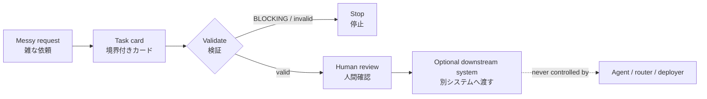

This is not an agent runtime.
This is not an autonomous router.
This is a preflight contract and validator for safely preparing tasks for AI workers.


# Agent Frontdoor

<p align="center">
  
</p>

<p align="center"></p>

> Fail-closed preflight validation for bounded AI task cards.
>
> AIに仕事を渡す前に、依頼を境界付きタスクカードへ変換し、危険な拡張を止めるための読み取り専用OSSです。

## What it is / これは何か

Agent Frontdoor is the **front door before an AI worker**. It does not run an
agent, choose a model, call an API, or grant authority. It turns an informal
request into an explicit contract that a human can inspect before any other
system acts.

Agent Frontdoorは、AIワーカーの「入口」です。エージェントを実行せず、モデル選択・API呼び出し・自動ルーティング・権限付与も行いません。人間の依頼を、別システムが実行する前に確認できる契約へ変換します。



## Safety promise / 安全境界

The package is deliberately boring and local:

- no execution, subprocess, socket, network, worker invocation, or routing;
- no scheduler, hook, daemon, server, deployment, credential, or secret access;
- no repair fallback, retry, automatic publish, or authority promotion;
- input files are read locally; results are deterministic stdout/stderr output;
- `UNKNOWN` and high-risk expansion fail closed with `BLOCKING`.

このパッケージが**しないこと**を明示するのが重要です。入力を直したり、危険な依頼を実行したり、別のAIへ自動転送したりはしません。検証に失敗したら、成功したふりをせず停止します。

## Core contract / 中核フロー

```text
request / 依頼
  -> schema + semantic validation / スキーマ・意味検証
  -> bounded task card / 境界付きタスクカード
  -> card | explain / 人間が読める出力
  -> optional check-drift / 変更による権限拡張の検出
```

The contract is versioned as `intake.v0` in
[`src/frontdoor/schema/intake.v0.json`](src/frontdoor/schema/intake.v0.json).
The public CLI and exit codes are stable; changing the schema version is an
explicit compatibility decision.

契約は `intake.v0` としてバージョン管理されています。スキーマを変える場合は、暗黙に挙動を変えず、互換性の判断として明示的に行います。

## Intent Lock / 脱線防止

The pure `intent-lock.v1` API keeps a proposed tool action attached to a literal
command or error target. It was added after repeated excessive derailment showed
that otherwise reasonable product, documentation, and authentication procedures
could combine without a common task-identity invariant. Intent matching does
not grant authority; every independent permission, safety, and human gate still
applies.

The core package remains read-only. Runtime state and platform event handling are
kept in the separately installable, optional sibling distribution
`agent-frontdoor-hooks`. See [`docs/INTENT_LOCK.md`](docs/INTENT_LOCK.md) for the
contract and [`adapters/README.md`](adapters/README.md) for reviewed installation,
configuration, and removal steps.

Codex and Claude Code examples are shipped as inert files at
`adapters/examples/codex-hooks.json` and
`adapters/examples/claude-settings.json`. They invoke
`agent-frontdoor-hook --platform codex` and
`agent-frontdoor-hook --platform claude`, respectively. Installing the adapter
does not activate either example or edit live settings.

Local hooks are a strong guardrail, not a security boundary: hosted or specialized
execution paths may fall outside their coverage. Current independent CC review is
recorded as `CC_UNAUDITED`; the label is disclosure rather than proof.

`intent-lock.v1` は、明示コマンドまたはエラー対象と次のツール操作を同じ依頼に固定する純粋な契約です。同じ依頼との一致は権限を付与せず、既存の許可・安全・人間承認ゲートを一切迂回しません。コアは読み取り専用のままで、状態保存と Codex / Claude Code のイベント差分は任意の別配布 `agent-frontdoor-hooks` に隔離されています。

## Quick start / 最短で試す

```bash
git clone <PUBLIC_REPOSITORY_URL> agent-frontdoor
cd agent-frontdoor
python3 -m venv .venv
.venv/bin/python -m pip install -e ".[test]"
.venv/bin/pytest -q
.venv/bin/agent-frontdoor validate fixtures/positive/01_install_only.json
.venv/bin/agent-frontdoor card fixtures/positive/01_install_only.json
```

Python 3.10以上が必要です。実行時のAgent Frontdoor自体はネットワークを使いません。ネットワークはインストール時の依存取得に限られます。完全オフラインの友人向け受入手順は [`docs/FRIEND_LAB.md`](docs/FRIEND_LAB.md) を参照してください。

## When to use / 使う場面

| Situation / 場面 | Frontdoor result / 出力 |
|---|---|
| A bounded implementation request / 境界付き実装依頼 | `IMPLEMENTATION` card |
| A design or security review / 設計・安全レビュー | `DESIGN_REVIEW` or `AUDIT` |
| An ambiguous or unsafe request / 曖昧・危険な依頼 | `UNKNOWN` + `BLOCKING` |
| A proposed expansion after review / レビュー後の拡張 | `check-drift` reports drift |

It is **not** a replacement for human judgment, a policy engine with authority,
or a full agent harness. It is the small, inspectable contract at the boundary.

人間の判断を置き換えるものでも、権限を持つポリシーエンジンでもありません。人間と実行系の間に置く、小さく検査可能な契約部品です。

---

## English documentation

The sections below are the detailed English reference: installation, CLI,
schema fields, gates, drift detection, fixtures, metrics, and uninstall.

## 日本語ドキュメント

### CLI

```bash
agent-frontdoor validate task.json       # 契約を検証
agent-frontdoor card task.json           # 固定順のタスクカードを表示
agent-frontdoor explain task.json        # 人間向け説明を表示
agent-frontdoor check-drift before.json after.json
```

`validate` が成功して初めて `card` と `explain` が出力されます。`check-drift` は、レビュー後に許可範囲が広がっていないかを比較します。

### ゲート

- `NONE`: 追加確認なし
- `CONFIRM`: 次の限定された手順の前に人間確認
- `BLOCKING`: 人間が明示的に解決するまで停止

deploy、production、scheduler、secret、auth、billing、delete、SSOT mutation、external publish、authority promotion は、原則 `BLOCKING` です。`UNKNOWN` も必ず停止側に倒れます。

### 友人向け受入

友人に渡す場合は、まずZIPと検証スクリプトのSHA-256を照合し、ネットワークを切断した状態で `docs/FRIEND_LAB.md` の手順を実行してください。受入試験はインストール、fixture、CLI、境界ガード、プライバシー検査、アンインストール、receiptを確認します。合格しても、友人の既存hook・settings・モデル・秘密情報を自動変更することはありません。

### OSS公開の原則

公開リポジトリには、秘密、実在ユーザー名、LANアドレス、個人パス、ローカルの履歴・memory・設定を含めません。友人固有の構成はアダプターとREADMEで説明し、本体コアへ混ぜません。

---

# Agent Frontdoor v0

Agent Frontdoor converts a messy human request into a bounded task card, validates
that card, and renders a human-readable explanation:

```text
messy human request
-> bounded task card
-> schema and semantic validation
-> human-readable explanation
```

The current contract is `src/frontdoor/schema/intake.v0.json` (installed as
package data), a JSON Schema Draft 2020-12 document plus deterministic semantic
checks in the validator.

## Safety boundary

Agent Frontdoor's core distribution performs preflight only. The package has:

- no task execution;
- no network requests;
- no worker invocation;
- no automatic routing;
- no runtime, daemon, server, or hook integration in the core distribution;
- no deployment, scheduler mutation, secret access, or authority grant;
- no task-file writes or repair fallback.

The CLI reads local JSON files and writes deterministic results to standard output
or standard error. A task card describes boundaries for another system; it does
not grant that system permission to act.

## Installation

Python 3.10 or newer is required. Supply the repository location explicitly;
the install procedure never infers a private checkout or operator path. The
standard installation may resolve `jsonschema>=4` and the `test` extra from
PyPI:

```bash
export AGENT_FRONTDOOR_REPOSITORY_URL='<PUBLIC_REPOSITORY_URL>'
git clone "$AGENT_FRONTDOOR_REPOSITORY_URL" agent-frontdoor
cd agent-frontdoor
python3 -m venv .venv
.venv/bin/python -m pip install -e ".[test]"
.venv/bin/pytest -q
.venv/bin/agent-frontdoor validate fixtures/positive/01_install_only.json
.venv/bin/agent-frontdoor card fixtures/positive/01_install_only.json
```

Agent Frontdoor itself requires no network access at runtime. Network access is
used only to retrieve dependencies during installation.

For the frozen-contract Gate 4 reproduction, create a fresh local bare
repository from the reviewed public commit and set
`AGENT_FRONTDOOR_REPOSITORY_URL` to its explicitly supplied `file://` URL. Use
the same clone, install, full-test, `validate`, and `card` sequence above.

### Offline installation

Do not reuse host or global packages for offline acceptance. Use only the
hash-verified, receiver-specific wheelhouse from the friend pack. The complete
attended procedure, detached verification order, controls, and receipt rules are
in [`docs/FRIEND_LAB.md`](docs/FRIEND_LAB.md).

```bash
export WHEELHOUSE='<VERIFIED_WHEELHOUSE>'
python3 -m venv .venv
.venv/bin/python -m pip install --no-index --find-links "$WHEELHOUSE" setuptools wheel
.venv/bin/python -m pip install --no-index --find-links "$WHEELHOUSE" --no-build-isolation -e ".[test]"
```

Missing or incompatible wheels are a hard stop. There is no index fallback,
source-build fallback, retry, or host-package fallback.

## CLI

The installed package exposes exactly four read-only preflight commands:

```bash
agent-frontdoor validate task.json
agent-frontdoor card task.json
agent-frontdoor explain task.json
agent-frontdoor check-drift before.json after.json
```

- `validate` prints a stable valid/invalid result.
- `card` prints the complete fixed-order task card only after validation succeeds.
- `explain` prints a self-contained explanation only after validation succeeds.
- `check-drift` validates both cards before comparing their boundaries.

Exit codes are part of the CLI contract:

- `0`: valid card or no drift
- `1`: loaded card is invalid
- `2`: input is unreadable or malformed JSON
- `3`: boundary drift detected

Output markers are equally strict: `INVALID` means a loaded card violated the
contract, `ERROR` means an input could not be read or decoded, and `DRIFT` means
a validated before/after pair crossed a named boundary. None of these results
executes or repairs the task.

For `check-drift`, an unreadable or malformed input takes exit-code precedence
over a loaded-invalid card. Diagnostics go to standard error; successful output
and drift findings go to standard output.

## `intake.v0` task card

Every card contains all 14 core fields:

| Field | Purpose |
|---|---|
| `schema_version` | Fixed contract version: `intake.v0` |
| `request_id` | Stable request identifier |
| `human_request` | Original human request |
| `task_class` | One bounded task class |
| `risk_tags` | Explicit safety-relevant categories |
| `allowed_actions` | Actions inside the task boundary |
| `forbidden_actions` | Actions explicitly outside the boundary |
| `required_evidence` | Evidence needed to verify the outcome |
| `required_manifest` | Optional named manifest, otherwise null |
| `human_gate` | Required human decision state |
| `predicted_worker_capability` | Capability label, never a model name |
| `unknowns` | Unresolved facts that must remain visible |
| `assumptions` | Explicit bounded assumptions |
| `next_safe_step` | The next non-escalating step |

The task classes are deliberately small:

- `RESEARCH`
- `DESIGN_REVIEW`
- `IMPLEMENTATION`
- `CODE_REVIEW`
- `AUDIT`
- `CONTENT_DRAFT`
- `DATA_ANALYSIS`
- `INSTALLATION`
- `OPERATIONS`
- `UNKNOWN`

Specific model or vendor names are not valid worker capabilities.

## Human gates and fail-closed rules

The three gate values are:

- `NONE`: no additional confirmation is required by this card;
- `CONFIRM`: a human confirmation is requested before the bounded next step;
- `BLOCKING`: stop until a human explicitly resolves the gate.

`BLOCKING` is mandatory when risk tags or request/action text involve any of:

- `deploy`
- `production`
- `scheduler`
- `secret`
- `auth`
- `billing`
- `delete`
- `destructive cleanup`
- `SSOT mutation`
- `external publish`
- `authority promotion`

`UNKNOWN` also fails closed: it requires `BLOCKING`, the
`none-until-clarified` capability, at least one stated unknown, explicitly safe
allowed actions, and a non-mutating next step.

The validator additionally rejects schema errors, a normalized action that is
both allowed and forbidden, unsafe non-blocking work, and malformed or unreadable
input. It returns typed issues rather than permissive prose.

## Boundary drift

`check-drift` reports every matching named expansion. The required families are:

- read-only audit -> mutation recommendation
- design review -> implementation
- installation -> architecture migration
- draft -> external publish
- proposal-only -> authority promotion
- bounded files -> unrelated broad refactor

The comparator uses deterministic lexical heuristics over validated task classes,
risk-tag additions, allowed actions, and `next_safe_step`. It never mutates either
card.

The split card examples can be passed directly to the CLI:

```bash
.venv/bin/agent-frontdoor check-drift examples/drift_before.json examples/drift_after.json
# exit 3: reports audit_to_mutation
.venv/bin/agent-frontdoor check-drift examples/safe_before.json examples/safe_after.json
# exit 0: prints NO DRIFT
```

## Fixtures and hard metrics

Synthetic fixtures live under:

- `fixtures/positive/` for complete valid cards;
- `fixtures/negative/` for named fail-closed cases;
- `fixtures/drift/` for labeled before/after envelopes and safe controls.

The `fixtures/drift/*.json` files are labeled test envelopes containing
`before`, `after`, `label`, and `expected_codes`; they are not direct CLI inputs.
Use the split cards under `examples/` for directly runnable CLI examples.

Run the hard corpus and source-safety contracts with:

```bash
.venv/bin/pytest tests/test_fixture_metrics.py tests/test_no_execution_paths.py -q
```

Run the complete local suite with:

```bash
.venv/bin/pytest -q
```

The hard contracts require schema validity `1.00`, negative blocking recall
`1.00`, fail-safe UNKNOWN behavior, boundary-drift recall of at least `0.95`, and
zero forbidden execution, network, worker, routing, or source-write paths.
These are test contracts, not claims about an unverified run.

## Uninstall

Remove the package from the active virtual environment without touching the
source checkout or any other environment:

```bash
.venv/bin/python -m pip uninstall -y agent-frontdoor
```

Confirm that `.venv/bin/agent-frontdoor` is no longer available. Deleting a
disposable test directory is a separate human action and is never performed by
Agent Frontdoor.

## Programmatic interfaces

The public local interfaces are:

```python
from frontdoor.boundary_drift import detect_boundary_drift
from frontdoor.formatter import format_card, format_explanation
from frontdoor.intent_lock import derive_lock, evaluate_action, record_result
from frontdoor.validator import load_card, validate_card
```

`load_card` reads one local JSON file and returns the loaded value plus a typed
validation result. `validate_card` and `detect_boundary_drift` are deterministic
and do not mutate their inputs. `derive_lock`, `evaluate_action`, and
`record_result` are pure intent-state operations; filesystem lifecycle support is
available only from the separate `agent-frontdoor-hooks` distribution.
