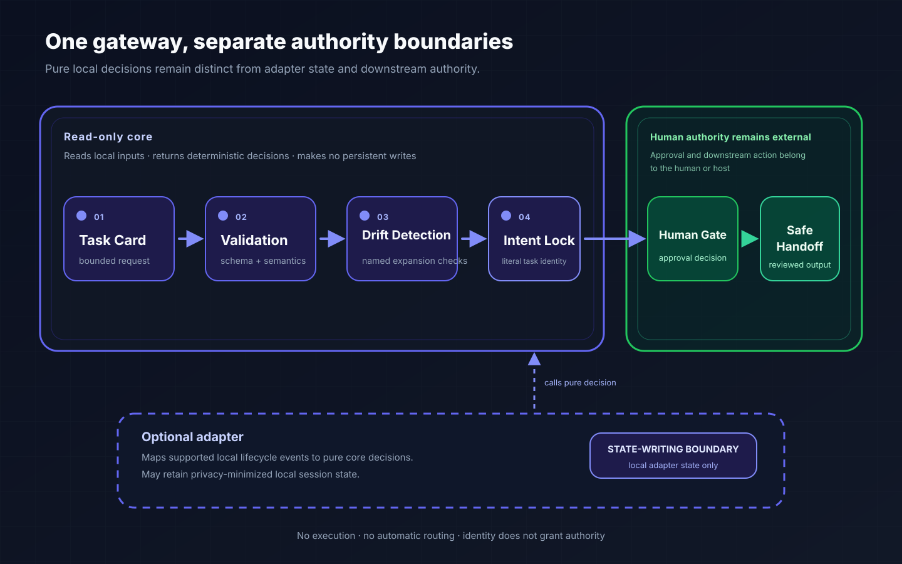

# Architecture

Agent Frontdoor is a local preflight boundary, not an agent runtime, router, or
authority system. Its core and optional adapter deliberately keep validation,
task identity, state, and authority separate.

## One gateway, three adoption routes

The read-only core distribution, `agent-frontdoor`, can be adopted on its own to
validate, render, explain, and compare local task cards. The optional
`agent-frontdoor-hooks` distribution is a separate POSIX-only adapter for local
Codex and Claude Code lifecycle events. A human or host may inspect either
output before deciding whether any downstream system should act.

Installing either distribution does not activate hooks, change settings, or
grant authority. The adapter maps local lifecycle events and stores only
privacy-minimized local state; it does not execute work, route work, or make an
authority decision.

## Three independent core primitives

```text
Task Card -> Validation -> VALID / INVALID
Baseline + revised card -> Drift Detection -> CLEAR / DRIFT
Prompt + proposed action -> Intent Lock -> ALLOW / DENY / HOLD
```

These are three independent primitives, not consecutive stages. Callers invoke
task-card validation for one loaded card, drift detection for one validated
before/after pair, or Intent Lock for one prompt and proposed action. The core
returns deterministic local results without routing an output from one
primitive into another.

The optional adapter maps supported lifecycle events to Intent Lock only and
can retain privacy-minimized local state needed for a session-scoped lock. It
does not integrate Validation or Drift Detection. The human or host remains a
separate authority boundary and owns permission, execution, and any handoff
after reviewing whichever result it received.



## Distribution and write boundaries

`agent-frontdoor` is read-only: it reads local inputs and returns decisions
without task execution, network requests, worker invocation, automatic routing,
or source writes. `agent-frontdoor-hooks` is an optional state-writing adapter;
its narrow write boundary is validated privacy-minimized local lock state. It
does not modify operator-owned settings or activate itself.

The optional adapter is a guardrail for supported local hook paths; it is not a security boundary.
Hosted, specialized, or otherwise uncovered paths remain outside its coverage. A
host's separate permission and authority controls stay independent of any
same-intent adapter result.

## Identity versus authority

Intent Lock answers whether a proposed action remains attached to a bounded
task identity. It does not decide whether that action is permitted. A matching
result does not grant authority, and a non-matching, failed, or opaque result
fails closed for the adapter workflow. In this design, human authority remains external:
a human or host must make any approval and execution decision.

## Data and privacy

The core makes no persistent writes. When used, the adapter's state is limited
to privacy-minimized local state such as validated lock data and one-way
digests. It does not retain raw prompts, commands, session identifiers, tool
results, credentials, or operator configuration. See [Intent Lock](INTENT_LOCK.md)
for the data contract and [Evidence](EVIDENCE.md) for measured repository
boundaries.

## Ecosystem position

Agent Frontdoor can be used independently before an operator adopts any related
project. The following projects are independently adoptable; none installs,
configures, or invokes another:

| Project | Role |
| --- | --- |
| [workflow-governance-model](https://github.com/UMEBOSHIISAN/workflow-governance-model) | Validates an evidence and authority trail. |
| [mothership-router](https://github.com/UMEBOSHIISAN/mothership-router) | Emits a human-gated dry-run manifest bound to a registry digest. |
| [mothership](https://github.com/UMEBOSHIISAN/mothership) | Holds portable contracts, diagnostics, and authority boundaries. |

## Limits

This architecture does not replace human judgment, host controls, an
independent security review, or verification of a downstream result. Use the
[Core Reference](CORE_REFERENCE.md) for the read-only CLI contract and
[Getting Started](GETTING_STARTED.md) for source-only adoption.
